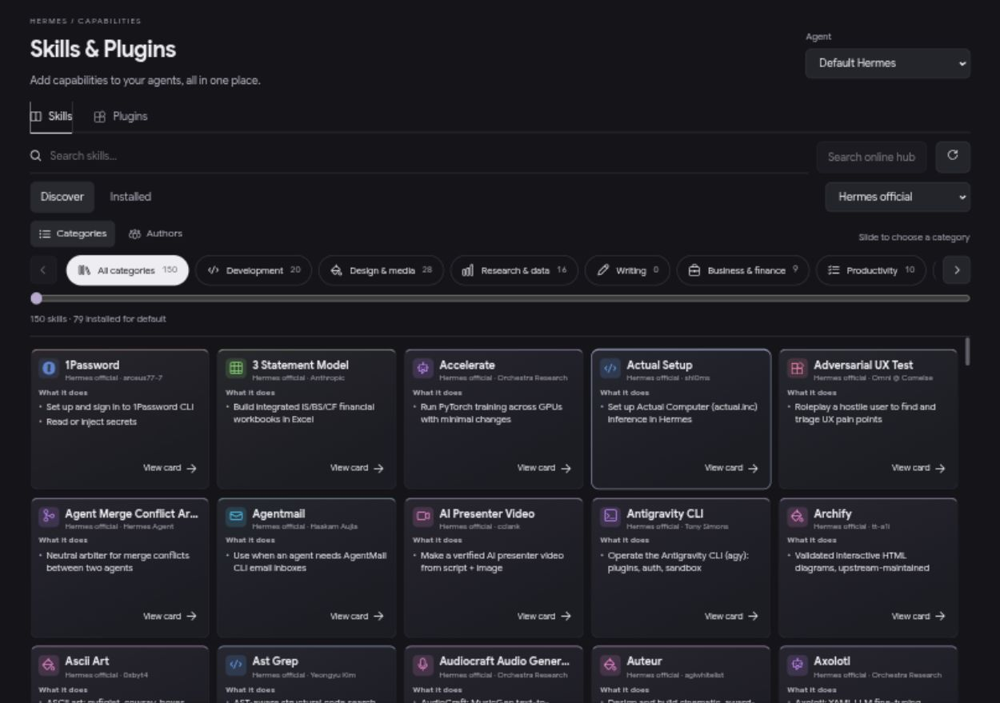
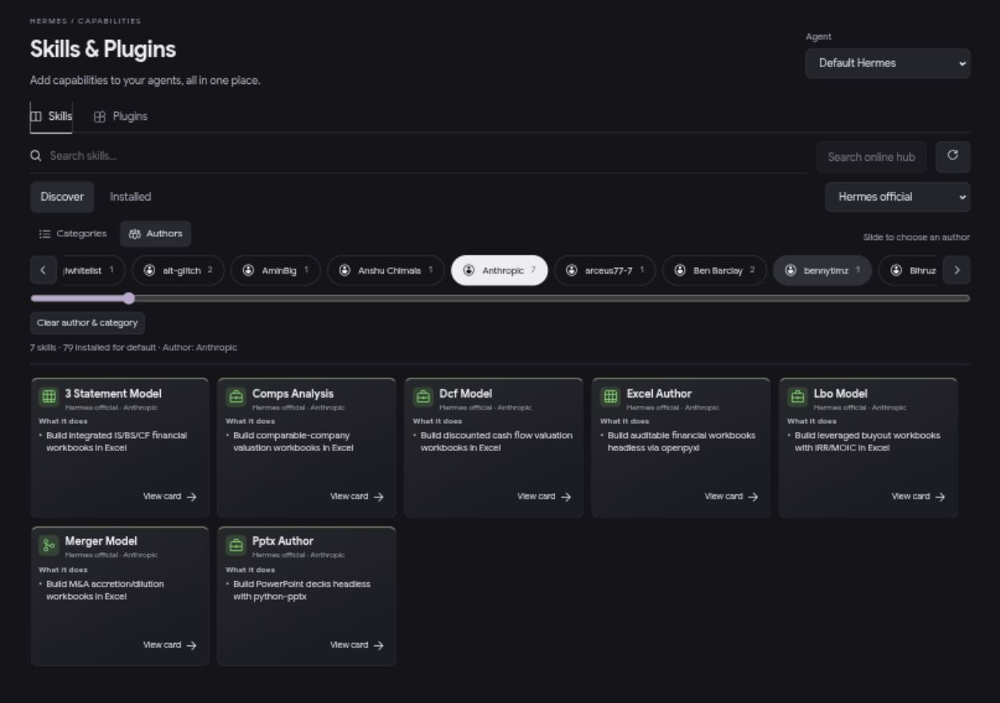
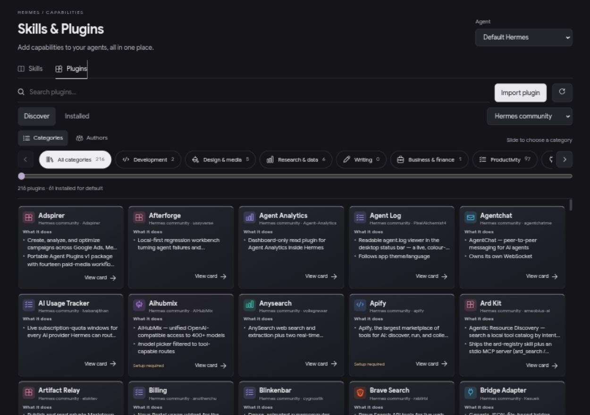
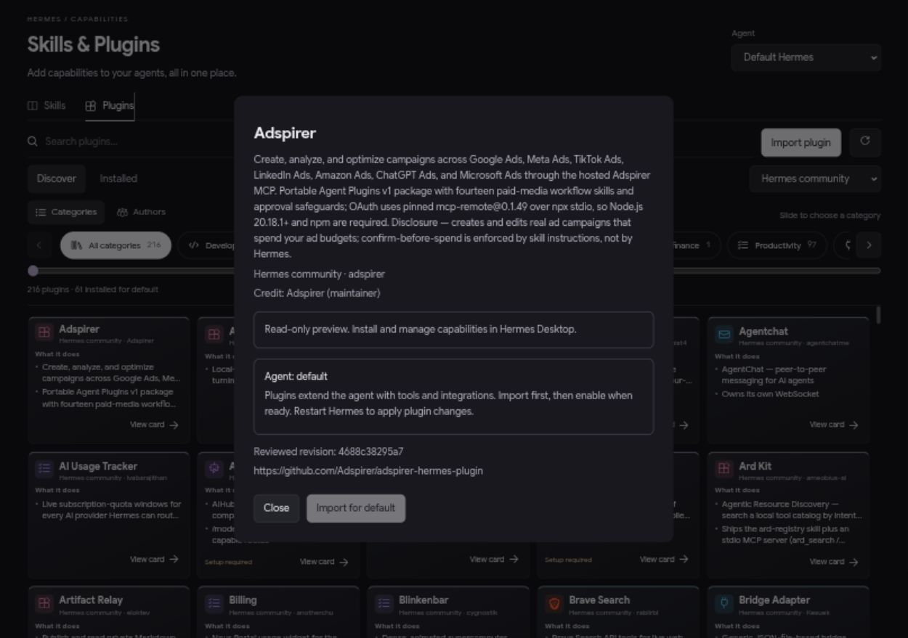
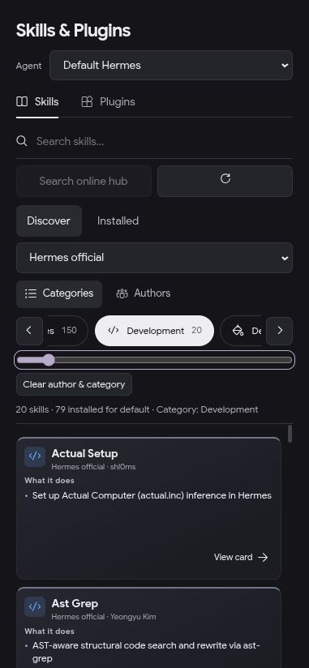
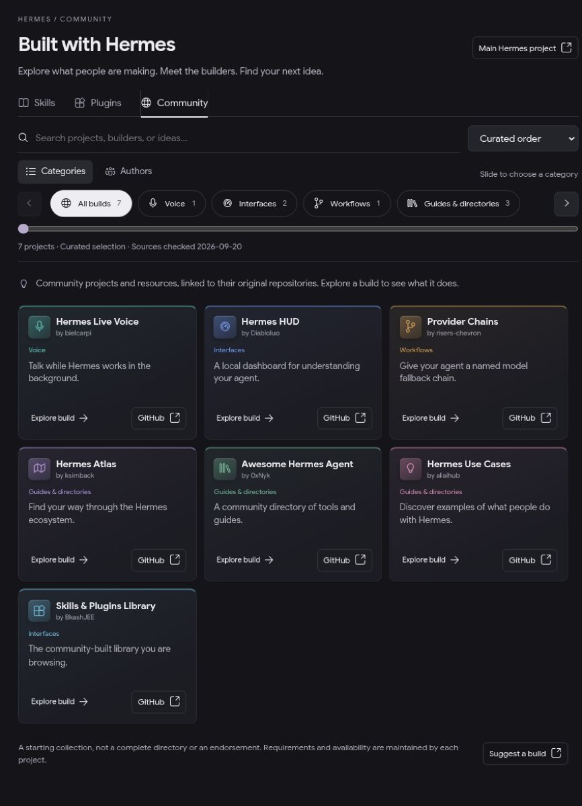
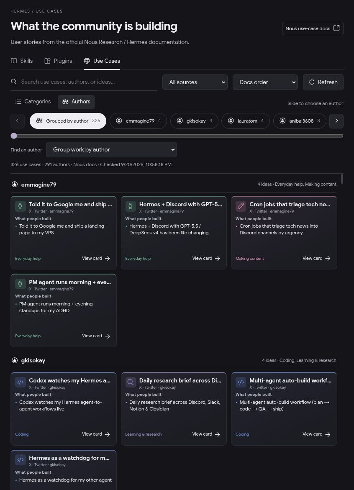

# Release audit — 0.3.0

Audit date: 2026-09-20. Scope: the independent Skills & Plugins sidebar plugin, its local browser preview, paired installer and backend integration. This does not audit Hermes' built-in Capabilities screens or certify third-party plugins.

**Verdict:** suitable for an early community release with the compatibility and permissions limits below. The primary browse/detail flow works at the tested sizes. Installation behavior was exercised with real Hermes APIs in disposable profiles; a fresh live Electron installation was not part of this audit.

## 1. Find a capability — working

Consistent 180px cards, brief summaries, colored icons and clear action placement make the catalog scannable. Reduced header spacing gives cards more room. Search with no matches shows a recovery action; Clear filters restores results. The results pane scrolls while the header stays fixed (observed header top remained 20px after results scroll exceeded 1,300px).

Card actions were increased from approximately 22px to 32px high. Five columns fit at 1280px. No horizontal document overflow or clipped card footers was observed at 1280×900 or 1280×600; the short window retained a 224px results pane on the Plugins screen.

Remaining: the header still consumes considerable vertical space. A collapsible filter area would help short windows. Descriptions are excerpts, not a complete account of what a package can do. Some long names and summaries are truncated; open details to read them.

## 2. Browse by author — working with metadata limits

The same rail supports categories and authors, with counts and a keyboard-operable range control. ArrowRight on the category slider selected Development and updated results. Selecting Anthropic returned seven matching skills in the observed official catalog. The full supplied credit remains in chip tooltips, accessible labels and the details dialog. Clear author & category resets the combined grouping filters.

Remaining: attribution depends on supplied metadata. Missing authors read Not listed. Different full credits can share the same short display label; full metadata stays distinct to avoid merging people incorrectly. Categories are inferred and can be wrong. Large author lists need a dedicated author search in a future release.

## 3. Inspect and import — working within the tested boundary

Plugins use the same layout. Details show the full description, attribution, selected profile and reviewed revision where available. The tested dialog showed the maintainer label correctly. Escape closed both detail and import dialogs.

The browser preview now explains that it is read-only, disables install/import/enable actions and blocks non-GET/HEAD requests in its server middleware. The repository import dialog fits a 390px viewport. Hermes Desktop remains the installation surface.

Backend integration tests cover resource-preserving skill installation, duplicate protection, profile isolation, enable/disable, invalid targets, symlink bundles, OS/dependency detection, plugin import/toggle/duplicate behavior, reviewed catalog revision and author metadata. Imported test plugins began disabled. These are API integration tests, not a live Electron click-through claim.

Remaining: structured permissions and failure modes are not supplied for every package. They cannot be inferred reliably from a summary. See [operations and recovery](OPERATIONS.md). Third-party plugin safety, remote hosts, authenticated repository imports and every external connector's runtime were not validated.

## 4. Narrow layout and accessibility — basic checks passed

At 390×844, cards use one column; controls wrap without horizontal overflow and action footers remain inside their cards. The fixed filter area is tall, leaving roughly one and a half cards visible when a grouping filter is active.

Visible focus styles, labeled inputs, full author accessible names, keyboard slider operation, live result counts and Escape dismissal were checked. This is not a WCAG conformance assessment. Screen-reader interaction, color contrast across host themes, text zoom/reflow and touch ergonomics still need dedicated testing. Source dropdowns currently assume a dark host theme. The smallest 10px metadata text is a readability tradeoff of the compact design.

## Packaging and validation

- MIT license, third-party icon notices, contribution guide, installation/removal instructions and GitHub Actions checks added.
- Removed machine-specific source paths and preview build dependency paths. Optional source roots use home-relative paths; sources.local.json stays private and survives updates.
- Installer enables only explicitly selected profiles, preserves unrelated settings/comments and backs up existing files/configurations. Dry-run performs validation without writes.
- `npm run check` and `npm run build:preview`: passed.
- `python -m unittest test_installer test_library`: 11 tests passed against Hermes revision `bce20d0b1f08518b499d06109f2b027519ddeca5` on Linux.
- Disposable-home installer smoke: dry-run wrote no installation directories; real install created both entries, enabled the selected default profile, preserved its comment and left another profile unchanged.
- CI covers JavaScript syntax, preview build, installer configuration tests and Python compilation. Full Hermes integration tests are separate.

Screenshots were captured and inspected during this audit from the local preview using real catalog data. Counts are observations, not fixed inventory promises. Linux dark mode is the tested environment; macOS, Windows, light themes and future Hermes API revisions remain unverified.

## 0.4.0 Community follow-up — 2026-09-20

Added seven source-linked public entries, shared section navigation, category/author rail, search, alphabetical sorting, detail dialogs and upstream/project links. Verified filtering to one builder/project, zero-result recovery, Escape dismissal, A–Z order and switching back to Skills/Plugins in the browser preview. At 390×844, there was no horizontal overflow or clipped card footer; the Community results pane retained 489px. Reduced-motion styles disable card movement. All 12 Python tests and the preview build passed. Desktop external opening uses the documented `ctx.os.openExternal` capability; native browser launching still needs live Electron verification. The collection is curated and bundled rather than a live social feed.

## 0.4.1 Desktop loading fix

A Desktop-only blank Community report exposed an unnecessary dependency on a newly added backend route. The browser preview route was healthy, but that did not establish availability in the running Desktop backend. Community now renders immediately from a committed, generated snapshot of the public directory. A regression test renders the real component with a backend that throws, and asserts every project link is present. CI checks snapshot synchronization and this regression. The fix does not restart gateways or require profile access. Native Desktop reload remains a user-side verification step.

## 0.5.0 Official documentation source

Replaced the independent seven-project collection with 326 entries from Nous Research’s official User Stories & Use Cases dataset at revision `299c652a66bcc915a2a1e10cd2b648f196ec4bba`. Preserved the upstream story titles, author credits, 15 categories, source platforms and original links. Added a source filter and explicit docs links; removed repository-owner and GitHub-only assumptions. Third-party post quotations are omitted. The collection remains bundled for immediate Desktop rendering. Source metadata is attributed under the upstream MIT notice.

### Compact Use Cases layout

Use Cases now shares Skills and Plugins card geometry: 180px height, 200px minimum grid columns, 26px icons, brief bullet content and an aligned View card footer. Category and shortened author attribution remain visible; full headlines and original-story/docs links remain in the detail dialog. Browser preview checks at its normal viewport and 390×844 found no horizontal overflow or summary/footer overlap across all 326 cards. The backend-independent rendering regression and JavaScript checks passed. Native Desktop rendering still requires reopening the installed plugin.

## 0.5.1 Use Cases refresh

Added an explicit Refresh action with a disabled loading state, last successful check time, new-story count and recoverable errors. Downloads are limited to the official Nous GitHub revision API and the story file at that immutable revision. Validated metadata is saved atomically; initial rendering still uses bundled cards, with optional cached updates. New categories and sources are included in the browsing controls.

Validation: all 20 Python tests passed, covering refresh persistence, no quotation persistence, invalid/oversized data, timeouts, write failures, concurrent refreshes, new categories, API errors, installer behavior and profile isolation. JavaScript checks, the backend-independent render regression and preview build passed. The live preview refreshed successfully from Nous, preserved the YouTube filter (17 results), retained its check time after reopening, and kept 326 cards visible when an older backend could not refresh. At 390×844, the button remained visible with no horizontal overflow or card-content overlap. Native Desktop loading still requires reopening the application after installing the updated backend.

## 0.5.2 Build previews and plain-language categories

Added delayed pointer-hover and keyboard-focus previews using the existing Desktop SDK Popover. The floating panel uses collision detection, short attributed excerpts from the official dataset, original-source links and real YouTube thumbnails. The grid size stays unchanged. Plain-language category labels replace jargon in chips and card footers while preserving Nous category IDs, counts and original names in tooltips.

Validation: all 22 Python tests passed, including fixed-revision preview requests, unknown-ID rejection, excerpt limits, in-memory caching and network failure behavior. JavaScript checks, backend-independent rendering, thumbnail URL validation and preview build passed. Browser checks verified live Reddit excerpts, a loaded YouTube thumbnail, keyboard opening, Escape dismissal, click-through to the existing details dialog and viewport containment at normal width and 390×844. Native Desktop behavior requires reopening the installed plugin; pointer-hover handlers use the same preview path but were not directly exercised by the available browser automation.

## 0.5.3 Author collections and compact credits

Use Cases now groups contributors with more than one story into named collections, ordered by story count. The Authors rail and an exact author selector can open one contributor's complete collection; category chips continue to narrow that collection. Single-story contributors remain in one compact “More authors” section so the catalog does not become hundreds of headings. The bundled dataset currently contains 326 stories from 291 credited authors, including 26 repeat contributors.

## 0.6.0 Guided use-case recreation

Every use-case card now pairs **Preview** with **Recreate**. Recreate opens a visible chat on the selected Agent and supplies the source story plus the active workspace. The kickoff prompt requires read-only inspection, asks whether the user wants a close recreation or a simpler adaptation, and makes permissions, credentials, costs, failure modes and recovery steps part of the plan. It explicitly blocks installs, edits, credential use and external actions until the user approves. The detail dialog repeats the action as **Build with Hermes** and explains the safety boundary. Older Desktop SDKs fail with an update message; browser preview does not create sessions.

Skills and Plugins cards now show a small explicit `by …` credit beside the source. Missing attribution reads `Creator not listed`; full supplied credit remains available in the title text and detail view.

Validation: JavaScript checks, grouping/credit unit assertions, backend-independent rendering, preview build and all 22 Python integration tests passed. Browser checks covered the complete grouped view, an exact four-story author collection, combined author/category filtering, card attribution, 326 rendered cards, zero clipped cards, no document overflow and no console warnings or errors at the tested desktop size. The visual QA report is in [`design-qa.md`](../design-qa.md). Native Desktop loading still requires reopening Hermes after the installed copy is updated.

